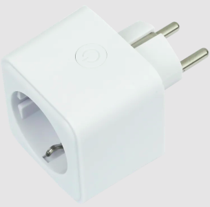
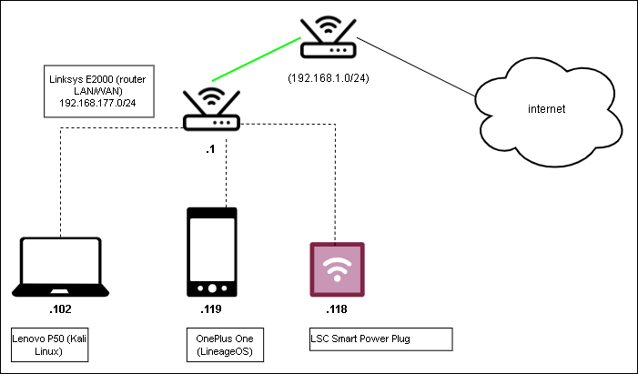
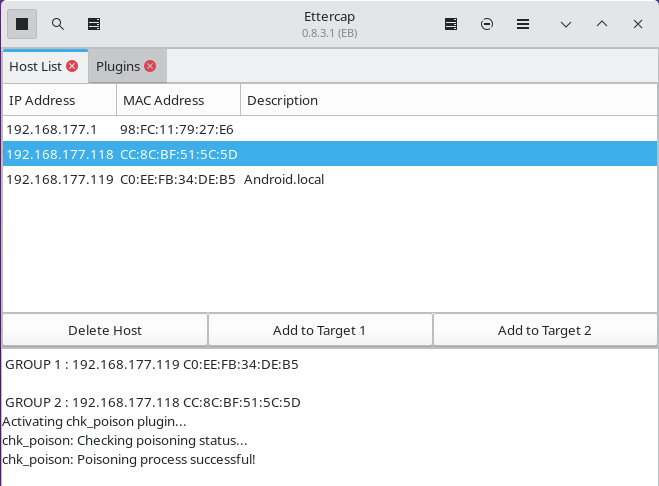
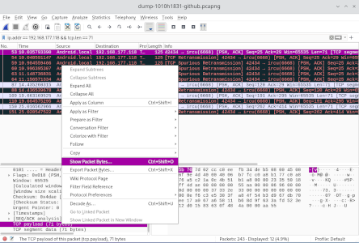
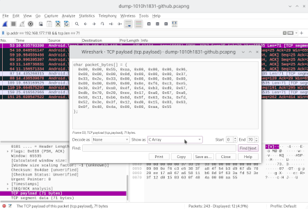
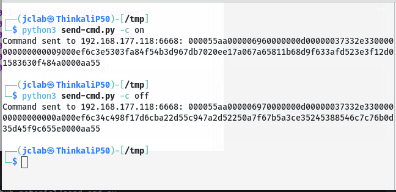
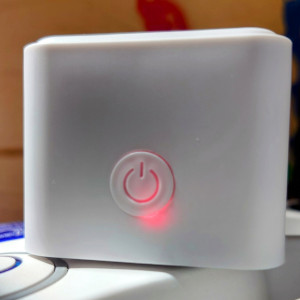
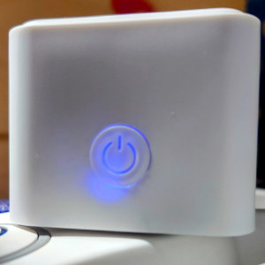

# Hacking Smart Power Plug

[Versão em inglês](README.md)

## Objetivo

Pretende-se analisar se é possível controlar o dispositivo IoT sem utilizar a APP e os serviços Cloud.

Esta experiência teve como motivação as aprendizagens durante a minha participação num Short Advanced Program (SAP) sobre Fundamentos da Ciber-Segurança.

O dispositivo IoT foi adquirido presencialmente numa loja Action em Leeuwarden (Holanda). Podes obter mais informações sobre o produto em [action.com/nl](https://www.action.com/nl-nl/p/2578685/lsc-smart-connect-slimme-stekker/)

## Configuração do laboratório utilizado

### Configuração de hardware utilizada neste laboratório

- Router LAN/WAN Linksys E2000;
- PC (Kali Linux);
- Smartphone OnePlus One (LineageOS)
- Smart Power Plug (LSC Smart Connect);

### Configuração de software utilizada neste laboratório

- PC (Kali GNU/Linux Rolling, GNOME v44.1, X11, Linux 6.5.0-kali2-amd64):
  - Ettercap v0.8.3.1 (EP);
  - Wireshark v4.0.10;
  - tcpreplay v4.4.4;
  - (opção 1) PyCharm Professional v2023.2.2;
  - (opção 2) VSCode v1.83.1;
- Smartphone (LineageOS 18.1 Android v11):
  - Tuya Smart v5.5.0(international) App v5.5.0(611) SDK v5.5.0;
  - (\*)LSC Smart Connect v1.1.4(international) App v1.1.4(15) SDK v4.3.0;

(\*) aplicação utilizada no primeiro teste

## Configurar MITM

Depois de se ligarem todos os equipamentos e associa-los à mesma rede do laboratório de testes. O processo inicia-se com a aplicação Ettercap para identificar todos os dispositivos ativos na rede e depois para implementar o MITM utilizando o ARP poisoning. Neste cenário de teste foi associado o smartphone a Target1 e o smart plug a Target2.

## Capturar pacotes da rede

Depois de feita a configuração do interface de rede na aplicação Wireshark, deve-se iniciar a captura de pacotes e neste momento utiliza-se o smartphone para ligar e desligar o smart plug, esta operação pode ser repetida mais do que uma vez para que o Wireshark capture todos os pacotes de cada sequência.

No final de algumas repetições, deve-se parar a captura e guardar num ficheiro no disco. Este ficheiro será útil para abrir, pesquisar e testar diversas iterações para identificar os pacotes de bytes para cada mudança de estados do smart plug.

Neste teste foi utilizado a condição de filtragem de pacotes "ip.addr == 192.168.177.118 && tcp.len == 71" porque neste cenário o padrão repete-se nas comunicações diretas entre o smartphone e o smart plug.

## Extrair informações capturadas

Depois de identificar os pacodes de bytes para cada um dos estados, deves repetir esta operação para cada um dos estados.

Expandir o objeto no painel inferior, posicionar o cursor em "TCP Payload" e fazer click com o botão direito do rato. Depois escolher as opções conforme mostram as imagens seguintes.

## "Replay attack"

A imagem mostra o resultado da execução do código [send-cmd.py](send-cmd.py)

**NOTA IMPORTANTE**: o código tem os dados de configuração obtidos durante os testes no meu laboratório, portanto se estiveres a tentar reproduzir este desafio é importante que faças as seguintes alterações nas variáveis do código:

- **default_ip_address**: coloca o IP do teu smart plug na tua rede de teste;
- **packet_bytes_on** e **packet_bytes_off**: coloca o conjunto de bytes extraídos do Wireshark para cada um dos estados.

## Comportamento do smart plug

Ligado

Desligado

